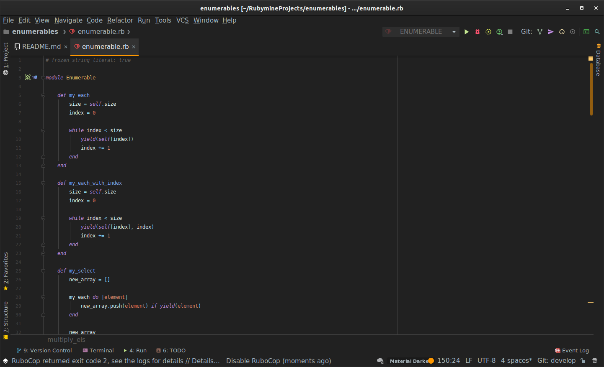

# Enumerable

##### Advanced Building Blocks - Enumerables

> This is my implementation of Ruby's enumerable methods

You can find the original description of this project here: 
[The Odin Project](https://www.theodinproject.com/courses/ruby-programming/lessons/advanced-building-blocks)

## Built With

- Ruby

## Getting Started

This project consists of the implementation of the following methods of `Enumerable` class
- `each`
- `each_with_index`
- `select`
- `all?`
- `any?`
- `none?`
- `count`
- `map`
- `inject`

> To get a local copy up and running follow these simple example steps.
 
### Prerequisites

- `Git`
- `Ruby`

### Setup

To clone the project in your local environment do the following

- Open a new `terminal` window and navigate to the directory where the project will be stored
- Run the command `git clone git@github.com:oscardelalanza/enumerable.git`
- Run the command `cd enumerable` to enter the project directory

### Usage

Copy and paste `enumerable.rb` file to your current project. Then import `Enumerable` module in your main class with 
`require_relative 'enumerable'`

### Run tests

- no written tests yet

## Authors

👤 **Oscar De La Lanza**

- Github: [@oscardelalanza](https://github.com/oscardelalanza)
- Twitter: [@twitterhandle](https://twitter.com/oscardelalanza)
- Linkedin: [Oscar De La Lanza](https://linkedin.com/in/oscardelalanza/)
- Email: oscardelalanza@gmail.com

## 🤝 Contributing

Contributions, issues and feature requests are welcome!

Feel free to check the [issues page](issues/).

## Show your support

Give a ⭐️ if you like this project!
